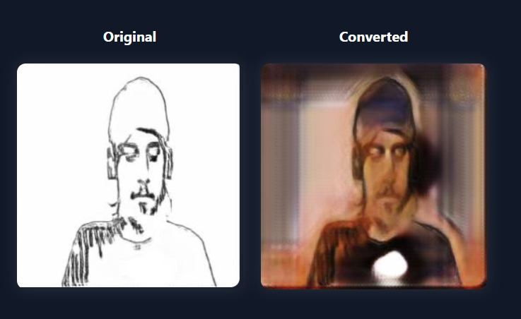
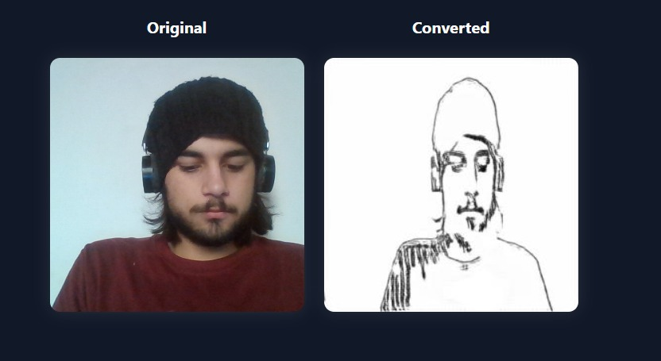

# Image <> Sketch Translation

This repository contains a small image-to-sketch / sketch-to-image generator project.

**Project layout**

- `models/` : trained model files (generators)
- `notebooks/` : analysis and demo notebooks (moved `image_generation.ipynb`)
- `screenshots/` : example outputs used in this README
- `src/` : (optional) source code and helper scripts
- `docs/` : (optional) documentation

**Included files (moved)**

- `models/generator_A2B_epoch30.pth` — generator A->B (renamed from `G_A2B_epoch30.pth`)
- `models/generator_B2A_epoch30.pth` — generator B->A (renamed from `G_B2A_epoch30.pth`)
- `notebooks/image_generation.ipynb` — the demo notebook (moved from `gen_q1.ipynb`)
- `screenshots/img_to_sketch.jpg` — example output (image -> sketch)
- `screenshots/sketch_to_img.jpg` — example output (sketch -> image)

**Quick start**

1. (Optional) Create a virtual environment and activate it.

```powershell
# from repository root (q1)
python -m venv .venv; .\.venv\Scripts\Activate.ps1
pip install -r requirements.txt
```

2. Open the demo notebook:

```powershell
jupyter notebook notebooks\image_generation.ipynb
```

3. Notes about models:

- The model files live in `models/`. If your models are large, consider using Git LFS before committing: `git lfs install; git lfs track "models/*.pth"`.

**Screenshots / examples**

Image to sketch:



Sketch to image:



If the images are missing, place your example outputs into `screenshots/` and re-run the notebook to regenerate examples.

**Contributing / Next steps**

- Move any helper scripts into `src/` and add a small runner script.
- Add license and more detailed docs in `docs/`.

---
*Generated and rearranged by a project assistant.*
